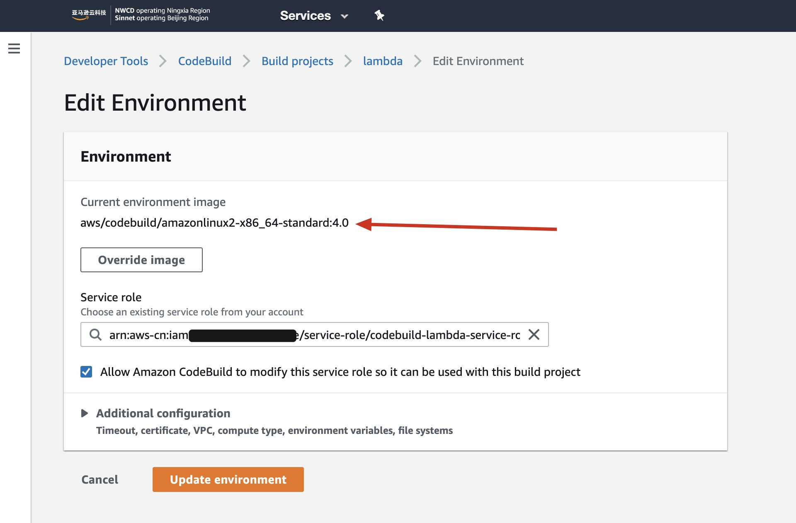
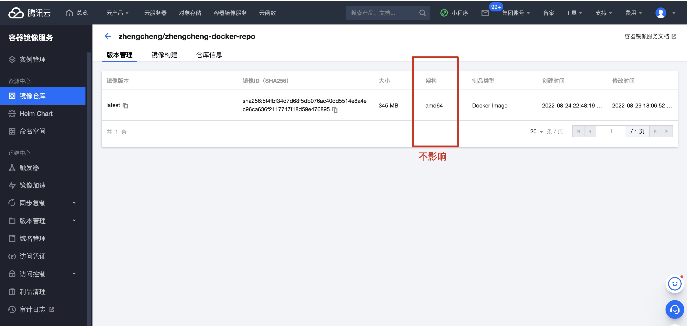
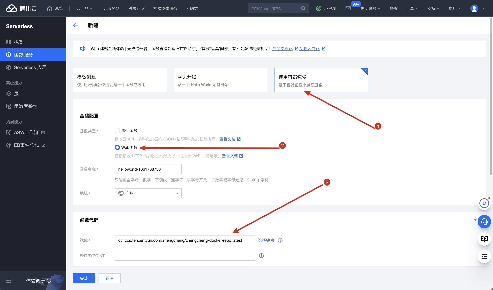
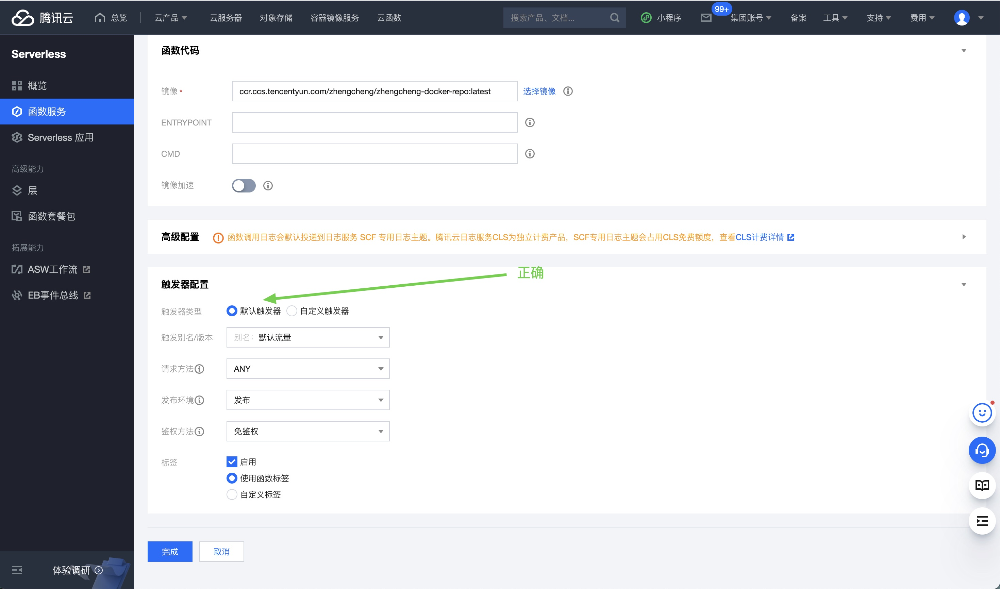
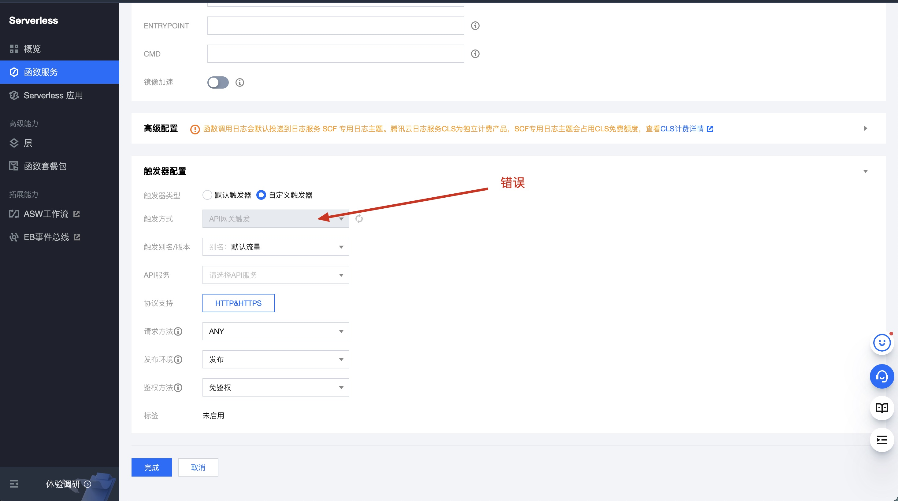

# 腾讯云 SCF + Ruby 容器镜像
(问题已解决，请直接翻到文章末尾看结论)

## 介绍
我们希望用 Docker Image 方式跑 Ruby 代码。  
部署到腾讯云云函数上。
但是使用过程中遇到问题。   
**本代码仓库用于给腾讯云工单工程师复现问题。**     

## 本地运行方法（不用 Docker)

先安装依赖
```
bundle install
```

运行服务器
```
ruby ./app.rb
```

访问 http://localhost:9000/

## 本地运行方法 (使用 Docker)
构建镜像
```
docker build --tag tencent-scf .
```

运行镜像
```
docker run -p 9000:9000 tencent-scf
```

访问 http://localhost:9000/

## 最核心的代码只有4个文件
* Gemfile, Gemfile.lock (依赖)
* Dockefile
* app.rb

## 部署到腾讯云的方法
1. 先推送到腾讯云 TCR 
2. 在[腾讯云 SCF](https://console.cloud.tencent.com/scf/list) 新建函数.
   1. "使用容器镜像"
   2. 填入镜像地址为 TCR 地址，如 `ccr.ccs.tencentyun.com/zhengcheng/zhengcheng-docker-repo:latest`
   3. 触发器为 "API 网关触发"
   4. 点击"完成"

# 解决方法（详细版）

## 一些背景信息：
* 我的电脑是 MacBook Pro（14英寸，2021年）芯片是 Apple M1 Pro。
* 我看到腾讯云云函数的[文档里有一句](https://cloud.tencent.com/document/product/583/56051)

> 云函数当前是基于 X86 架构运行的，所以暂不支持运行在 ARM 平台上构建的镜像。ARM 的平台典型如 Apple Mac 搭载 M1 芯片的 PC 端。


所以我用了 AWS Codebuild 来负责构建 Docker Image。  
以下截图的意思是，我用的容器镜像是 `aws/codebuild/amazonlinux2-x86_64-standard:4.0`



注意：TCR 上的镜像是 AWS Codebuild 运行 `docker build` 和 `docker push` 得到的。不是我本地 M1 Pro build + push 的。

### 如果你也想用 AWS Codebuild 构建镜像，以下是 `buildspec.yml` 供你参考。

```yml
version: 0.2

env:
  variables:
    # (请修改这个）你要推送到腾讯 TCR 的镜像 URL。(另外，这个也会作为 docker build 的 --cache-from 参数）
    IMAGE_URL: ccr.ccs.tencentyun.com/zhengcheng/zhengcheng-docker-repo:latest
    
    # (请修改这个）腾讯云 TCR 的密码。
    TENCENT_TCR_PASSWORD: [密码当然填你自己的]
    
    # 本地临时用一下的 tag 名字。
    DOCKER_TAG_NAME_TEMP: tencent-serverless-image

phases:
  pre_build:
    commands:
      - echo 登录到腾讯云
      - echo $TENCENT_TCR_PASSWORD | docker login --username=100006309506 --password-stdin  https://ccr.ccs.tencentyun.com
  build:
    commands:
      # 看一下文件
      - ls
      - yum install -y tree
      - tree

      # 构建镜像
      - docker build --tag $DOCKER_TAG_NAME_TEMP --build-arg BUILDKIT_INLINE_CACHE=1 --cache-from $IMAGE_URL --file Dockerfile ./

      # 打标签
      - docker tag $DOCKER_TAG_NAME_TEMP:latest $IMAGE_URL

      # 推送镜像。
      - docker push $IMAGE_URL
```


## 关于架构
1. 腾讯云 TCR 里显示架构 arm64 并不碍事。这个并不影响。可以正确运行。



# 解决方法（简略版）
## 1. 新建函数的时候除了选择你自己的镜像，其他保留默认即可。  


## 2. 这个默认触发器是正确的


## 3. 不要改成 API 网关触发


