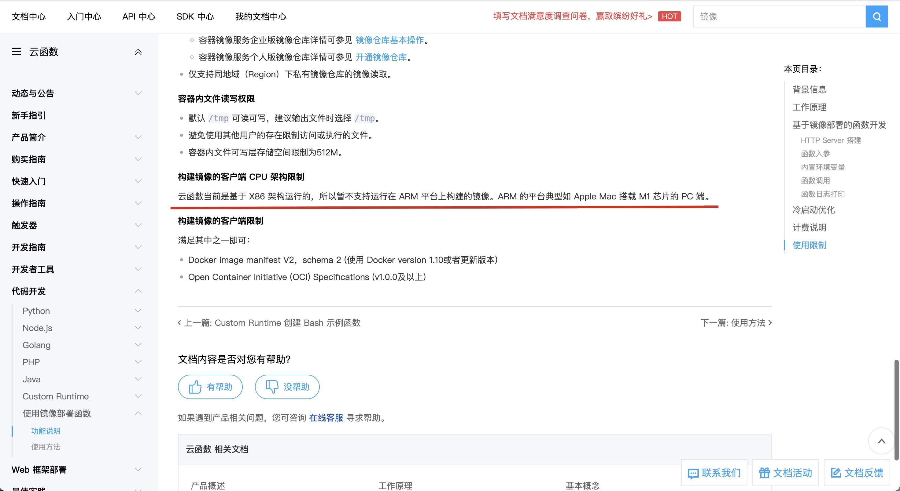

# 例子: 腾讯云 云函数(SCF) 如何运行 Ruby 的容器镜像
## 介绍
我希望用 Serveless 的方式跑一些 Ruby 代码。   
因为这些代码的运行次数非常低，比如一天一次，或者是事件方式触发，发生了某些事情，才触发。  
最终目的是做一些数据分析工作，从一个数据库里读取内容，做一些计算，然后存入另一个数据库。      

我选择了腾讯云的云函数来做这件事，   
因为 AWS Lambda 不支持固定 IP 功能，而我需要固定 IP 来访问 AWS RDS 数据库。    

但是把 Docker Image 部署到腾讯云的时候遇到问题。   
本代码仓库用于给腾讯云工单工程师复现问题。   

**更新：问题已解决**

## 本内容对读者有什么价值
读者可以参考文章末尾给出的建议，避免和我一样踩坑。  

## 本地运行方法（不用 Docker)

先安装依赖
```
bundle install
```

运行服务器
```
ruby ./app.rb
```

访问 http://localhost:9000/

## 本地运行方法 (使用 Docker)
构建镜像
```
docker build --tag tencent-scf .
```

运行镜像
```
docker run -p 9000:9000 tencent-scf
```

访问 http://localhost:9000/

## 最核心的代码只有4个文件
* app.rb
* Dockefile
* Gemfile
* Gemfile.lock

# 解决方法（详细版）(可能不适用于你的情况，可以跳过不看)
[点击此处](https://github.com/1c7/tencent-scf-serverless-ruby#%E8%A7%A3%E5%86%B3%E6%96%B9%E6%B3%95%E7%AE%80%E7%95%A5%E7%89%88) 直接看 `解决方案（简略版）`

## 一些背景信息：
* 我的电脑是 MacBook Pro（14英寸，2021年）芯片是 Apple M1 Pro。


* 我看到腾讯云云函数的[文档里有一句](https://cloud.tencent.com/document/product/583/56051)

> 云函数当前是基于 X86 架构运行的，所以暂不支持运行在 ARM 平台上构建的镜像。ARM 的平台典型如 Apple Mac 搭载 M1 芯片的 PC 端。



所以我用了 AWS Codebuild 来负责构建 Docker Image。  
以下截图的意思是，我用的容器镜像是 `aws/codebuild/amazonlinux2-x86_64-standard:4.0`


注意：TCR 上的镜像是 AWS Codebuild 运行 `docker build` 和 `docker push` 得到的。不是我本地 M1 Pro build + push 的。

### 如果你也想用 AWS Codebuild 构建镜像，以下是 `buildspec.yml` 供你参考。

```yml
version: 0.2

env:
  variables:
   # (请修改这个）你要推送到腾讯 TCR 的镜像 URL。(另外，这个也会作为 docker build 的 --cache-from 参数）
   IMAGE_URL: ccr.ccs.tencentyun.com/zhengcheng/zhengcheng-docker-repo:latest

   # (请修改这个）腾讯云的账号 ID
   TENCENT_ACCOUNT_ID: 100006309506
   
   # (请修改这个）腾讯云 TCR 的密码。
   TENCENT_TCR_PASSWORD: [密码当然填你自己的]
   
   # 本地临时用一下的 tag 名字。
   DOCKER_TAG_NAME_TEMP: tencent-serverless-image

phases:
  pre_build:
    commands:
      - echo 登录到腾讯云
      - echo $TENCENT_TCR_PASSWORD | docker login --username=$TENCENT_ACCOUNT_ID --password-stdin  https://ccr.ccs.tencentyun.com
  build:
    commands:
      # 看一下文件
      - ls
      - yum install -y tree
      - tree

      # 构建镜像
      - docker build --tag $DOCKER_TAG_NAME_TEMP --build-arg BUILDKIT_INLINE_CACHE=1 --cache-from $IMAGE_URL --file Dockerfile ./

      # 打标签
      - docker tag $DOCKER_TAG_NAME_TEMP:latest $IMAGE_URL

      # 推送镜像。
      - docker push $IMAGE_URL
```


## 关于架构
1. 腾讯云 TCR 里显示架构 arm64 并不碍事。这个并不影响。可以正确运行。


# 解决方法（简略版）
## 1. 新建腾讯云的[云函数](https://console.cloud.tencent.com/scf/list?rid=1&ns=all)时，除了选择你自己的镜像，其他设置保留默认即可。  


## 2. 默认触发器是正确的。


## 3. 改成 `API 网关触发` 就会出问题。


### 补充
我没空深究这些不同触发器的细枝末节，我只知道 `默认触发器` 的效果和我本地运行的效果一样。   
而用 `API 网关触发` 就会返回一堆 JSON，而不是我想要的返回结果。


## 正确的返回结果


## 因为代码就是这样写的  


